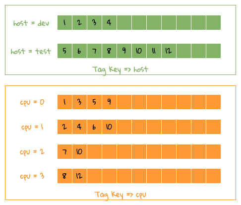

# Index

The main function is to facilitate the `Filtering/Grouping` operation of `Tags` under a `Metric`, and also to improve the overall query efficiency.

The entire index is an inverted structure, similar to `Lucene`, but it is simpler, because there is no need to do word segmentation in scenarios such as time series.

## structure

### Metadata

It mainly stores `string->uint32` data conversion, similar to the classic `OpenTSDB` design idea.

#### Namespace

| Key | Value |
| ---- | ---- |
| Namespace(string value) | Namespace ID(uint32) |

#### Metrics

| Key | Value |
| ---- | ---- |
| Namespace ID + Metric Name(string value) | Metric ID(uint32) |

#### Field

| Key | Value |
| ---- | ---- |
| Metric ID | Field List |

```yaml:no-line-numbers
The structure of a single Field is as follows:
Field ID: It is unique under this metric, and this ID is used when storing data
Field Name: field name
Field Type: Field type, such as Sum/Min/Max, etc.
````

#### Tag Key

| Key | Value |
| ---- | ---- |
| Metric ID | Tag Key List |

```yaml:no-line-numbers
The structure of a single Tag Key is as follows:
Tag Key ID: It is unique under this Database, and this ID is used when storing Index
Tag Key : Tag Key(string value)
````

#### Tag Value

| Key | Value |
| ---- | ---- |
| Tag Key ID | Tag Values ​​Trie |

Among them, `Tag Value` stores all the values ​​of `Tag Value` under the `Tag Key` in the `Trie` structure, and generates a unique value under the `Tag Key` for each `Tag Value` through the structure of `Tag` `Tag Value ID`.

### Index

Since the operation of `string->uint32` has been done in `Metadata`, it is actually stored by numbers in `Index`, which further reduces the storage space.

#### Forward

| Key | Value |
| ---- | ---- |
| Series IDs(Roaring Bitmap) | Tag Value IDs(Array) |

:::tip
The Forward Index is different from the traditional index. The traditional index will store each piece of written data as a forward record. The corresponding time series are the corresponding Tags of the Time Series, and these Tags pass through the string- After the >uint32 conversion, it becomes a string of data, so these data can be compressed into a Forward Index.
:::

#### Inverted

| Key | Value |
| ---- | ---- |
| Tag Value ID | Series IDs(Roaring Bitmap) |

## Inquire

The following is an example to illustrate `Filtering/Grouping`.

### Filtering

The following table is the forward data corresponding to the `Tags` under a `Metric(cpu)`, there are `3` `Tags` which are `host/cpu/type`

| Tags | Series ID |
| ---- | ---- |
| host=dev cpu=0 type=SCHED | 1 |
| host=dev cpu=1 type=SCHED | 2 |
| host=dev cpu=0 type=TIMER | 3 |
| host=dev cpu=1 type=TIMER | 4 |
| host=test cpu=0 type=SCHED | 5 |
| host=test cpu=1 type=SCHED | 6 |
| host=test cpu=2 type=SCHED | 7 |
| host=test cpu=3 type=SCHED | 8 |
| host=test cpu=0 type=TIMER | 9 |
| host=test cpu=1 type=TIMER | 10 |
| host=test cpu=2 type=TIMER | 11 |
| host=test cpu=3 type=TIMER | 12 |

If the data in the above table is inverted, the inverted structure of the following table is formed, and the `Posting List` is directly stored in the `Roaring Bitmap`.

| Tag | Posting List |
| ---- | ---- |
| host=dev | 1, 2, 3, 4 |
| host=test | 5, 6, 7, 8, 9, 10, 11, 12 |
| cpu=0 | 1, 3, 5, 9 |
| cpu=1 | 2, 4, 6, 10 |
| cpu=2 | 7, 11 |
| cpu=3 | 8, 12 |
| type=SCHED | 1, 2, 5, 6, 7, 8 |
| type=TIMER | 3, 4, 9, 10, 11, 12 |

At the same time, the `Tag Values` under `Tag` is stored in the form of a prefix tree to facilitate filtering operations on `Tag Value`, such as prefix filtering operations such as `host like dev*`. After adding the above inverted structure, it is very convenient for the conditional filtering operation. For example, the operation of multiple conditions only needs to do ** and **/** or ** operations on multiple `Posting List`, basically you can Filtering operations such as `And/Or/Not` that satisfy multiple daily conditions.

:::tip
E.g:
* Case 1: host = test or host = dev, which is the "and" operation of two Posting lists
* Case 1: host != test, this is to find the Series IDs below the host and the Series IDs of host = test, and get an AntNot(Difference) operation for these two Posting lists.
:::

At the same time, based on this inverted structure, it may support some `Metadata` queries, such as wanting to know what `Value` is under the `Tag` of `host`.

### Grouping

So, if the forward data is not stored, how to solve the `Group By` operation by pressing one or several `Tag Key`? If we need to segment the `Tag Value` like `Lucene`, it is basically impossible to deduce the forward data through the reverse, but in a scenario like `TSDB`, we do not need to `Tag Value` `Do word segmentation, so it is still possible to reverse the forward data through the reverse data.

As shown in the figure below, the forward data of a single `Tag Key` has been restored to `Tag Key/Value => Series IDs` for easy understanding.



Let's take the previous example to illustrate how to get the data of `Group By host, cpu` `2` `Tag Key`, as shown in the figure above, in fact, as you can see from the figure, the whole operation is a merge Operation, there are `2` methods.
1. Because each data is sorted, it can be sorted by `2` heaps, that is, `host` and `cpu` are placed in one heap respectively, and each time a value is taken from each heap, If the values ​​are the same, it means that `2` is satisfied. For example, `host=dev, cpu=0` corresponding to `TSID = 0`, you can find the corresponding `Group By` data, and so on, after traversing `2` The data in each heap can be finally combined. This method will occupy `CPU` and occupy less memory;
2. Use something like `Counting Sort`, that is, pre-allocate a fixed-size array, and then put `Series IDs` in the corresponding array subscript, as follows: `1` also includes `2` tags The data of Key` is what we want, and so on, you can get all the data, `CPU` occupies less, but wastes memory;

Combined with the structure of `Roaring Bitmap High/Low Container`, a `Container` can have up to `65536` `uint16` values, so the memory usage can also be controlled, so we use `Counting Sort` method to The corresponding forward data is derived, and the overall process can be processed in parallel by `Container`.

#### References
1. [RoaringBitmap](http://roaringbitmap.org/)
2. [Akumuli Inverted Index](https://akumuli.org/akumuli/2017/11/17/indexing/)
3. [Counting Sort](https://en.wikipedia.org/wiki/Counting_sort)
4. [Trie](https://en.wikipedia.org/wiki/Trie)
5. [Succinct Data Structure](https://en.wikipedia.org/wiki/Succinct_data_structure)
