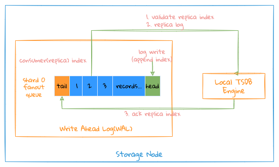
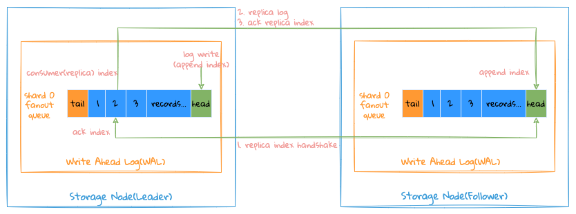

# copy

## Overview

For the replication of distributed storage, consensus protocols such as Paxos, Raft, and ZAB are commonly used in the industry. More than half of these protocols will sacrifice certain performance to strictly ensure data consistency.

The scenario faced by `LinDB` is that the amount of writing is huge, and the requirements for data consistency are not very high. It also allows short-term data inconsistency, but it is eventually consistent. Therefore, `LinDB` adopts the strategy that the success of writing to the `Leader` means that the writing is successful.

Writing to `Leader` is successful and has the following benefits:
- Can improve write performance;
- Any machine can be deployed in the cluster, while Paxos, Raft, ZAB, etc. require at least 3 machines;

Writing to `Leader` is successful, there are the following problems:
- Data consistency problem: once the `Leader` hangs, a new `Leader` is elected, and the new `Leader` copying new data may overwrite the data written by the old `Leader`;
- Data loss problem: once `Leader` hangs, and the data block that is not copied to `Follower` is also damaged at this time, this part of data will be lost;

In order to solve the above problems and try to ensure that data is not lost, `LinDB` adopts a multi-channel replication scheme, as shown in the following figure:

Take the data shard `Shard 3` as an example:
- When `Node 1` is used as `Leader`, enable the `1-WAL` write channel, `Node 1` receives new data and writes it to the `1-WAL` channel, and writes the `1-wal` channel to the `1-wal` channel The data is copied to the `1-WAL` channel of `Node 2` and `Node 4`;
- When `Node 1` hangs and `Node 2` is elected as the new `Leader`, the `2-WAL` write channel is enabled, and `Node 2` receives new data and writes to the `2-WAL` channel , and copy the data in the `2-WAL` channel to the `2-WAL` channel of `Node 4`;
- When `Node 1` starts, `Node 1` will continue to copy the data in the `1-WAL` channel that has not been copied to `Node 2` and `Node 4` to their corresponding `1-WAL` channels . `Node 2` will supplement the data in the `2-WAL` channel to the `2-WAL` channel of `Node 1`;

That is, start the write channel with `Leader` as the starting point. For example, the `1-WAL` channel is always the `Node 1` replication channel to `Node 2` and `Node 4`, and the `2-WAL` channel is always `Node 2` Duplicate channels to `Node 1` and `Node 4`, `4-WAL` channel is always `Node 4` duplicate channel to `Node 1` and `Node 2`, and so on,

:::tip
`Node 1` corresponds to the unique identifier `1` in the cluster, and so on for other nodes.
:::

This way of copying solves the following problems:
- Avoid the problem of data inconsistency: only one person is responsible for the authority of the data for each channel, so there will be no conflict;
- Try to avoid the problem of data loss: as long as the data that has not been copied in the old `Leader` is not lost, it will be copied to other copies after it gets up again. If the data that has not been copied in the old `Leader` is lost, this part of the data will be lost;

Preconditions that can be used for multi-channel replication:
- Allow data to be written out of order: data is written to multiple channels and loses its order. The time series data scenarios faced by `LinDB` do not need to guarantee that transactions can be written out of order.

:::tip
Since a major feature of time series data is time correlation, `LinDB` also shards data by time according to this feature when storing data. Each time shard is a storage unit, so the actual replication channel is also stored with Units correspond one-to-one.
:::

## local copy

The entire local copy writing process is as follows:
- The system will start a write coroutine for each `Shard` replication channel, and this coroutine is responsible for all write operations on this channel, including when it is a `Leader` or `Follower`, the coroutine will complete the write operation;
- First, write the data corresponding to `namespace/metric name/tags/fields` into the index file of the database, and generate the corresponding `metric id/time series id/field id`, which mainly completes the conversion of `string->int`; The advantage of this is that all data stores are stored in data types to reduce the overall storage size, because for each data point, metadata such as `namespace/metric name/tags/fields` is occupied, such as `cpu{host= 1.1.1.1} load=1 1514214168614`,
In fact, after converting to `id`, the storage will be `cpu => 1(metric id), host=1.1.1.1 => 1(time series id), load => 1(field id)`, simplified to `1 1 1514214168614 =>1`, please refer to [index](index_.md) for the specific index structure;
- If the writing of the index fails, it is considered that the writing has failed, and the failure is divided into `2`;
  1. There is a problem with the data writing format, such failures are directly marked as failures;
  2. Due to internal problems, the writing fails and needs to be retried;
- Write the data into the storage unit through the `ID` obtained by the index, similar to `LSM`, write the in-memory database first, and directly write to the memory to achieve high throughput requirements. After the memory data reaches the memory limit, the `Flush` will be triggered For details, please refer to [Storage Format](storage.md), [Memory Database](memory.md);

For write operations, you need to pay attention to the following replication `Index`:
- `Consume(Replica) Index`: where the write coroutine has been processed, each write operation will first verify whether the `Index` is legal;
- `Ack Index`: which data in this channel has been successfully written and persisted to storage;

Here are a few things to note:
1. The write coroutine will consume the written data from the `WAL` channel in order, so the `Replica Index` is an ordered pointer, so it is easier to check with the persisted `Index` to verify the data whether it has been written;
2. The `Flush` coroutine is used to synchronize the `Ack Index` to notify which data has been written successfully;
3. Since all write operations first write to the memory, and then persist the data in the memory to the corresponding file, if the system crashes during this process, because there is no `Ack Index`, even if the data in the memory is lost, every write When the coroutine starts, it consumes the data in the `WAL` channel with `Ack Index` as the current `Replica Index`, so it is done, the data can be recovered after the crash;

## remote copy

The above figure `Node 1` is `Leader`, `3` copies to copy `1-WAL` for example to illustrate:

Currently `Node 1` accepts the write of `Broker` for the `Leader` of the data shard `Shard`, `Node 2` and `Node 4` are both `Follower` accepting the replication request of `Node 1`, at this time The `1-WAL` channel is used as the current data write channel.

  
`Index` basic concept description:
- `Append Index` of each channel, indicating the location where the channel writes data;
- Each channel retains each `Follower Consumer (Replica) Index` and `Ack Index`, respectively indicating the position where each `Follower` has been consumed (consumed but the request is still on the way, the position has not yet confirmed the successful consumption) and The location where the consumption has been successful;
- `Tail Index` of each channel: indicates the minimum value of all `Follower Ack Index`, the `WAL` before the `Index` can be deleted;

The entire replication process is as follows:
- `Leader` will start an independent coroutine for each `Follower` replication, get the data of the `Follower Consumer(Replica) Index` from `WAL` of `Leader` and send it to `Follower`;
- `Follower` compares the `Append Index` of the local `WAL` with the `Consumer(Replica) Index` after receiving the data;
  - Write if equal and return `Consumer Index` to `Leader` as `Ack Index` (normal case);
  - If not equal, return the `Append Index` of your own local `WAL` to `Leader`;
- After `Leader` receives the response, judge whether the `Ack Index` returned by `Follower` is equal to `Consumer(Replica) Index`;
  - if equal to update the `Ack Index` of the `Follower` (normal case);
  - If it is not equal, it is divided into the following situations:
    - When `Follower Ack Index` is smaller than `Tail Index` of `Leader WAL`, it means that `Follower` local `Append Index` is too small, `Leader` has no data at this position, so `Follower` needs to be reset Your own `Append Index` is the `Tail Index` of `Leader`;
    - When the `Follower Ack Index` is greater than the `Append Index` of the `Leader WAL`, it means that the `Append Index` of the `Follower` is too large, and the `Leader` has no data at this position, and the `Leader WAL` needs to be changed. Append Index` is raised to `Follower Ack Index`, and `Follower Consumer(Replica) Index` is raised to `Follower Ack Index`;
    - When `Follower` is between `Tail Index` and `Append Index` of `Leader WAL`, you need to reset `Follower Consumer(Replica) Index` to `Follower Ack Index`;

The process of `Leader` and `Follower` to initialize the replication channel is similar to `TCP` three-way handshake.

## sequential

Generally speaking, multi-channel replication does not guarantee the order of the overall data. In most cases, only one of the channels is used. It is necessary to ensure the order of replication of the channel. With order, it is easier to know which data has been copied. Which data has not been replicated.

To ensure the sequentiality of the replication process, it is necessary to ensure the sequentiality of the following links:
- Sequential sending of `Leader` copy requests;
- The `Follower` side processes replication requests sequentially;
- The response of the `Leader` side to the copy request needs to be guaranteed to be sequential;

Since the entire writing and copying process is based on the `GRPC Stream` long connection and single-coroutine processing mechanism, the above conditions can basically be guaranteed.

#### refer to
1. [bigqueue](https://github.com/bulldog2011/bigqueue)