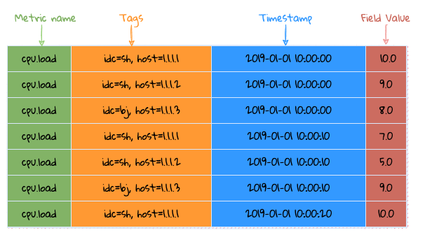
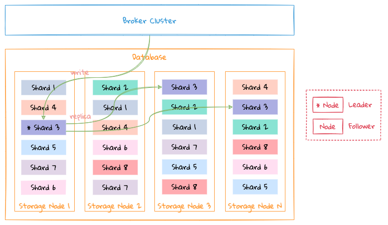
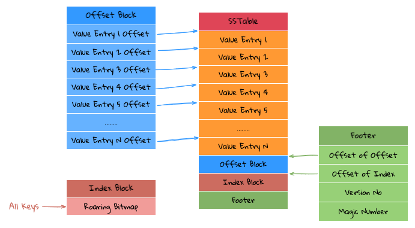

# store

All data of `LinDB` will be stored on the local disk, and there are different storage structures according to different data types:
- `Metirc Metadata`: store `Metric Name` and its underlying `Fields`/`Tag Keys`;
- `Tags(Series) Index`: store all `Tags` under a `Metric`, this part is divided into `2` data types;
    * Forward: `Tags` corresponding to `Series ID`;
    * Reverse: store the inverted index of `Tag Key/Value`, that is, which `Series ID` is under each `Tag Value`, `Series ID` is stored using [RoaringBitMap](http://roaringbitmap.org) ;
- `Data`: storage of `Data Point` under all `Time Series`;

All of the above data types are stored in a common underlying `KV Store`.

## Timing Characteristics

Before talking about storage, let's talk about the characteristics of timing, as shown in the figure:



Time series data characteristics (according to its time characteristics, it can be divided into time-invariant and time-variant data)
1. `Time Series` => `Metric + Tags`: This part of the data is basically a string, and this data occupies the bulk of the data packet, but it will not change with time.
Try to convert strings into numerical values ​​for storage to reduce storage costs;
2. `Fields`: This part of the data is basically numeric and changes with time, but the numeric type is easy to compress;

## storage structure

### Database



- The data of a database is distributed on different nodes of the `Storage` cluster according to `Shard`;
- A `Shard` can have multiple copies, please see [Replication](replication.md) for details;

### Shard

```md:no-line-numbers
├─ db_test_1
| ├─ meta
| | ├─ namespace
| ├─ metric
| | ├─ field
| | ├─ tagkey
| └─ tagvalue
| └─ shard
| ├─ 1
| ├─ inverted
| ├─ forward
|  | └─ segment
|  | ├─ day
|  | | ├─ 20190101
|  | | | ├─ 01
|  | | | ├─ 02
|  | | | └─ 23
|| | └─ 20190102
|  | ├─ month
|  | | ├─ 201901
|  | | | ├─ 01
|  | | | ├─ 02
|  | | | └─ 31
|  | | └─ 201902
|  | └─ year
|  | ├─ 2019
|  | | ├─ 01
|  | | ├─ 02
|  | | └─ 12
|  | └─ 2020
| └─ 2
└─ db_test_2
````

The above is the storage directory structure of data on a `Storage` node, taking the data structure of a single database on a single node as an example:
- `meta`: store all `metadata`, at database level:
  * `namespace`
  * `metric`
  * `field`
  * `tag key`
  * `tag value`
- `shard`: A database will have multiple `shard`s on a single node, and each `shard` has the following data:
  * `index`: store forward and reverse indexes;
  * `segment`: store the data of each time slice;

See [index](index_.md) for the structure of `meta` and `index`.

All data is calculated according to the `Interval` of the database to store specific data in time slices:
- The time series has strong time correlation, which can better handle data query;
- It is convenient to handle `TTL`. If the data expires, just delete the corresponding directory directly;
- There are multiple `segments` under each `shard`, and each `segment` stores the data of the corresponding time slice according to the corresponding `interval`;
- Why are there many `data families` stored according to `interval` under each `segment`? This is mainly because the main problem solved by `LinDB` is to store a large amount of monitoring data. The general monitoring data is basically written at the latest time, and basically no historical data is written. The data storage of the entire `LinDB` is similar to the `LSM` method, so In order to reduce the merge operation between data files, which leads to write amplification, it is finally measured, and then the `segment` time slice is sharded.
 
The following is an example of `interval` being `10s`:
1. `segment` is stored by day;
2. Each `segment` is divided into `data family` by hour, one `family` per hour, and the files in each `family` store specific data in columns;

## KV Store

```md:no-line-numbers
└─ kv_store_1
   ├─ CURRENT
   ├─ LOCK
   ├─ MANIFEST-000010
   ├─ OPTIONS
   ├─ family_1
   | ├─ 000001.sst
   | ├─ 000002.sst
   | ├─ 000004.sst
| └─ 000008.sst
   ├─ family_2
   | ├─ 000011.sst
   | ├─ 000012.sst
   | ├─ 000014.sst
| └─ 000018.sst
   └─ family_3
````

The whole `KV Store` is similar to `LSM`, but it is different from `LSM`. The main differences are as follows:
- There is no `Memory Table`, because the whole system will have a `Memory Database` to store all the data of the current period of time, and these data will be directly written to the `KV Store`;
- `Key` is all `uint32`, because all `string` will be converted to `uint32` according to the timing characteristics, so the underlying `KV Store` is directly designed as a `uint32 => binary` structure;

The whole directory is very similar to `rocksdb` and supports `column family`.
- `CURRENT`: record the currently valid `MANIFEST` file;
- `LOCK`: file lock to prevent multiple processes from opening the same `KV Store`;
- `MANIFEST`: `change log` of all `sstable` changes, including some `change log` of `sequence`, etc.;
- `OPTIONS`: `KV Store` configuration information, including configuration information at each `column family` level;
- `KV Store` can store multiple `column families`, and each `family` stores multiple `sstable` files;

### Compaction


- Each `KV Store` will start a `Goroutine` periodically to `Check` whether there are too many files in each `Family Level 0` and meet the conditions of `Compaction`;
- How to satisfy the condition, the corresponding `Family` will be notified to execute `Compaction Job`, if there is already `Compaction` being executed, this operation will be ignored, the whole operation will only be completed in one `Goroutine`, the advantage of this is that the whole operation It is a lock-free operation, because `Compaction Job` is a very heavy operation, and if locking is required, it may affect the writing of new files

`Compaction` mainly merges the files in `Level 0` into `Level 1`. Currently, `LinDB` has only `Level 2`, which is different from `LevelDB`.

`Compaction` condition, any one of the following conditions will trigger the Compact task:
- the number of files in `Level 0` exceeds the number of files configured;

The merge process will currently have `2` classes:
- Directly move the files of `Level 0` to `Level 1`, but need to meet the conditions of `compact`, the number of files of `pick files from level 0` is `1`, the number of files of `pick fiels from level 1` is `1` The number of files is `0`, that is, only one file needs to be merged, just modify `Metadata`;
- Need to combine multiple files into one large file;

The `Compact` process is as follows:
1. Select the file that needs `Compact`, first select the current `level 0` file, then traverse each `level 0` file, press `key range` to get the overlapping file from `level 1`, why is here? Fetch `level 1` files by each `level 0` file, not by the final `key range` in `level 0`. Because the `keys` of the entire `level 0` file may be relatively hashed, so if you take the final `range`, you may get a large range. E.g:

``````yaml:no-line-numbers
for example:
Level 0:
    file 1: 1~10
    file 2: 1000~1001
    
Level 1:
    file 3: 1~5
    file 4: 100~200
    file 5: 400~500
    
- If you press the final range of level 0, 1~1001, this will take out all the files of level 1
- If you take it according to the range of each level 0, you only need to take the file 3 (1~5) in the end.
``````

2. The entire `compact` process is actually a multi-way merge process. Since the `key` is sorted when `flush` writes files, `compact` only needs to read each file in order, and press ` The order of key` can traverse the data from these files;
  - During the process, the data with the same `key` needs to be merged. The merging process needs to be merged according to different data types, and the `Merger Interface` needs to be implemented;
  - If `key` does not need the merge operation, write the corresponding data directly to the file, which can reduce unnecessary serialization operations;
3. `compact` merging and writing files is successfully completed. You need to submit `Version Edit` to `Version Set`. At this time, `Version Edit` includes newly written files and old files that need to be deleted. This process requires locks;
4. Delete some useless files, such as files that have been merged, or some intermediate result files after failure. It should be noted here that the cleanup operation must be done after the `Version Edit` is successfully submitted to the `Version Set`, otherwise It will lead to the problem of data file confusion;

:::tip
- Version Edit: Similar to LevelDB, a Version Edit will be recorded for each file write operation, and Version Edit will record new files/deleted files, so that when the system restarts or crashes, just reload the Version Edit Log again. There are those that mention the whole useful document;
- Version Set: record which files are currently stored and available;
:::

### Rollup


`Rollup Job` is a special `Compact Job`, which mainly deals with data reduction (`Downsampling`), namely `10s->5m->1h`, its core logic is the same as `Compaction Job`, the main differences are as follows :
1. `Source Family` merges data into `Target Family` to operate `2` `Family`;
2. After the merging is completed, delete the files that need `Rollup` in `Source Family Version`, and record the files that have been `Rollup` in `Target Family Version` to prevent duplicate data merging;

### SSTable Layout



The structure of each `SSTable` is shown in the figure above, and it mainly has the following components:
- `Footer Block`: Mainly store `Margic Number(8 Bytes) + Version(1 byte) + Index Block Offset(4 bytes) + Offset Block Offset(4 bytes)`, which can be accessed through `Index Block Offset` and `Offset Block` Offset`The two `Offset` read the contents of `Index Block` and `Offset Block`;
- `Index Block`: use `Roaring Bitmap` to store all the `Keys` in the current `SSTable` file, because all `Key` are `uint32`, so you can directly use `Roaring Bitmap` to store, such benefits Yes, you can use `Roaring Bitmap` to determine whether a `Key` exists, and at the same time you can also know the position of this `Key` in this `Roaring Bitmap`;
- `Offset Block`: store all the `Offset` of `Value Entry`, and each `Offset` is stored with a fixed length, so if it is found in the `Nth` position in the `Index Block`, The `Offset` of that `Value Entry` is the data pointed to by `N * Offset Length`;
- `Value Entry`: store the `Value` corresponding to each `Key/Value`, because the `Key` is already stored in the `Index Block`, so the `Value Entry` only needs to store the `Value` in the `Key/Value` `You can;

The advantage of this is that the compression of `Key` can be done well, and `Roaring Bitmap` has done a lot of optimization on `Bitmap`, `Get` data through `Key` is very efficient, because it is not like `LevelDB` In that case, the `Key` needs to be queried in the middle, and the `Bitmap` can be resident in memory.

Based on the above storage structure, the entire query logic is as follows:
1. Through `Index Block`, you can directly know whether the queried `Key` exists. If it does not exist, return it directly. If it exists, get the first position (`Index`) in the `Bitmap`;
2. First jump: According to the `Index` obtained above, in `Offset Block`, after skipping `Index * Offset Length`, you can get `Value Entry Offset(Position)`;
3. The second jump: According to the `Position` obtained above, skip the `Position` at the beginning of the file and then the desired `Value` can be read directly;

If you want to do the `Scan` operation, you can directly read the sequence based on the `Index Block` and `Offset Blcok`.

#### refer to
1. [RoaringBitMap](http://roaringbitmap.org)
2. [OpenTSDB UID](http://opentsdb.net/docs/build/html/user_guide/uids.html)
3. [RocksDB](https://rocksdb.org/)