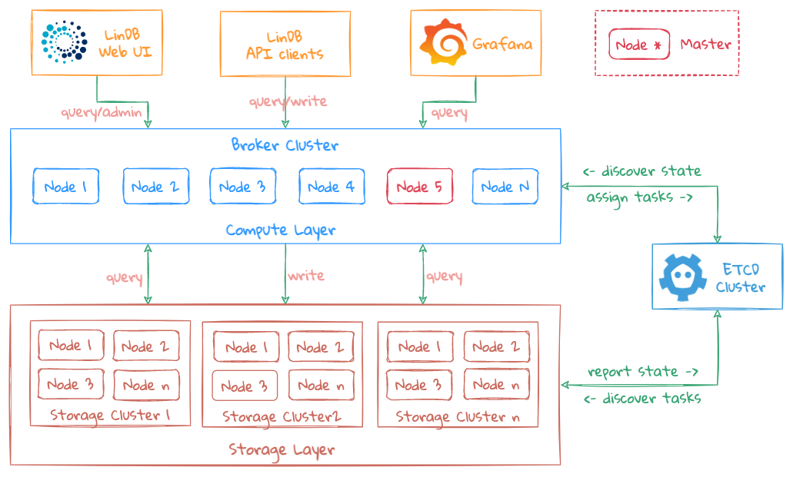

# Architecture

## Design Goals

- Sufficiently simple for usability and serviceability;
- Support cluster mode;
- Support replication;
- Support multiple IDCs;
- Eventually Consistency;
- Self-monitoring ability;
- Self-governance ability;

## Overview

LinDB is mainly composed of several components：
1. Broker
2. Storage
3. ETCD

### Broker

Broker is a stateless service with horizontal expansion capacity.

Master is the node with special responsibilities of Broker, which executes the modification of Metadata.

Each Broker node could be the Master, but Master node won't maintain or store too much Metadata. All Metadata is stored in ETCD, so the Master will be quickly freely elected from the Broker when problem occurs. The switch operation is automatically done by the system and the election process is preemptive.

The main responsibilities of the Broker are as follows:

1. All read and write operations are exposed to the end-user, and the user will interacts with the Broker primarily;
2. WAL Replication;
3. Executing the user's query request and generating different execution plans according to the specific query conditions;
4. Aggregating the data returned by Broker/Storage as the compute layer.
5. Re-aggregating the query results of multiple IDCs.

### Storage

Storage is also a stateless service which stores the data without the Metadata. Therefore, the Storage has the ability to scale horizontally. The main responsibilities are as follows:

1. Storing all data and index;
2. Storing self's Metadata;
3. Perform data filtering and simply aggregation operations(the most atomic aggregation calculation); 
4. Reporting self status periodically;

### ETCD

ETCD is the only external dependency of the entire system, and which is designed as a weak dependency.
In other words, LinDB is capable of providing external services when ETCD is unavailable.

The main responsibilities of ETCD are as follows:

1. Storing Metadata, such as database configuration, information about sharding, etc;
2. Storing status information, such as the status of each node in the Broker/Storage cluster;
3. Coordinator task state management: all changes to Metadata are sent to the Storage node through ETCD;

How to achieve the weak dependency of ETCD:

- Prerequisites:
  1. When ETCD is down, the is no modification of Metadata, such as not modifying the configuration of database;
  2. The cluster status is healthy, which means that the current Metadata/Status is available;
- Status Reporting ability of Broker/Storage: when data in ETCD is unavailable or lost, Broker/Storage will report Metadata/Status to the new ETCD cluster;