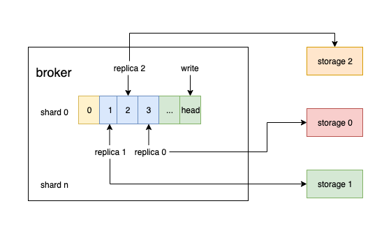

# Replication

The client sends the time series data (including database, metric name, tags, timestamp, fields information) to the broker through the tcp or http protocol. The broker first determines whether the database exists. If exist, calculate the shard number according to the total number of shards configured, metric name, tags, and database, then write the data to the corresponding memory buffer of the shard. When the buffer size exceeds the limit or the write time exceeds the limit, the data in the memory buffer is appended as a record to the disk log file to which the current shard belongs.

A shard according to the configured number of replicas will correspond to one or more physical storage nodes. The broker queries the data in etcd to learn the information, and replicates the records in the shard log file to the corresponding storage node through rpc. According to the current design, the storage directly writes the record data into the memory, and no additional wal is needed. After the in-memory data is written to the disk, the storage informs the broker that this part of the data has been completely consumed through rpc. After all the storage nodes inform the broker consuming records successfully, the broker can delete the disk log file.

The replication process of a shard can be abstracted into the production and consumption process of the Fanout queue. The implementation is inspired by [bigqueue](https://github.com/bulldog2011/bigqueue). The broker calculates the shard number of time series data, batches in-memory for efficiency, then write to the Fanout queue, the asynchronous go routine is responsible for pushing the data to the corresponding storage node. 

The time series database does not require the sequential writing. As long as the data is finally written, the result of the query is consistent. The sequence is maintained when replicating records from broker to storage in order to ensure accurate data replication under various abnormal scenarios.

Broker replication procedures:

1. The broker consults the index of the storage consumption record. If the index is valid (neighter exceeding the head index currently written by the broker, nor less than the tail index that the broker has already acked), go to step 3, otherwise go to step 2.

2. Reset the index of the storage with the index recorded by the broker, and proceed to step 3.

3. Replicate records from the index to the storage, if there is an exception, go back to step 1.

Storage replicaiton procedures:

1. Respond to the broker query, reset index request

2. Receive the record of the push copy of the broker, check whether the index of the record and the index of the storage record are consistent. If yes, return ok, index increments by 1, otherwise it returns an error.
