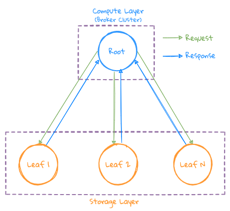

# 查询

## 概览

参与查询的角色如下：
- Broker: 接收用户的查询，根据查询语句生成相应的执行计划，并下发到相应的 Storage 节点，同时会聚合各 Storage 节点返回的结果，生成最终的结果
- Storage: 执行数据的过滤，Downsampling 和 最简单的原子计算（即有一定的算子下推的能力）

整个查询顺序如下，这里不分是在 Broker 还是 Storage 上执行，只看整个查询过程：
1. Query Language Plan
2. Filtering
3. Scan Time Series
4. Grouping if need
5. Downsampling
6. Aggregation
7. Functions
8. Expressions

由于 LinDB 是用 Golang 实现，因此可以通过 Goroutine 就能很好的支持一个异步操作及高并发，但系统还是采用了 Goroutine Pool 的概念来处理这些异步 Task。

整个查询过程都是异步完成，以异步 Task 的方式工作，即 Task A 只做一件事情，Task A 的结果可能是 Task B 的 Input，但是 Task B 不会等待 Task A 结果的到来，而是以 Event 的方式 Trigger Task B，最终完成一个查询 Pipeline 执行。

这里需要特别说明的是，系统不会开几个 Goroutine 来完成一个请求，而是在不同的 Goroutine Pool 中完成，所有的 Task 都是没有返回值的，通过 Event 来 Trigger。

下面举一个例子来说明，例如 Scan Goroutine Pool 只做 Scan 的操作，而不是启了一个 Goroutine Scan 数据，等待下一个 Task 结果再返回给上层 Task 来做合并，整个处理过程中各 Goroutine 还是会等待，而是直接把 Scan 的结果直接给下一个 Task，数据合并有专门的 Task 来完成，这样的好处是 Scan Goroutine 完成一个 Scan 操作之后，又可以做下一个 Scan 操作，可以更充分的利用系统资源。

尽量通过 Streaming 的方式来完成整个查询过程，以减少没有必要的对象创建带来的 GC 压力，同时也会对一些可以复用并且高频的对象进行 Pool 化，以提升内存的使用率。

根据不同的查询条件，可以 Plan 出如下几大类型的执行计划： 
- Simple Query: 简单的聚合查询；
- Complex Query: 带 Grouping 的查询；
- Cross IDC Query: 跨 IDC 之间的查询；

## 简单查询

- 只做数据的过滤，Downsampling 及 Aggregation
- 由于没有 Grouping 操作，因此最终的结果可以直接可以在 Root 节点进行聚合

## 复杂查询

- 由于在一些场景下面做 Grouping 再求 Top N 的时候，会返回大量的 Grouping 之后的数据，如果此时再把这些数据返回给一个计算节点的话，可能导致这个节点的内存成为瓶颈，因此引入了 Intermediate Broker 节点参与中间结果的计算
- 执行计划会在当前可用的 Broker 节点中，挑选一些 Intermediate Broker 来参与计算
- Root 会把请求下发给 Intermediate Broker, 由 Intermediate Broker 再下发给个自对应的 Storage 节点
- Storage 会按 Grouping 之后 Series 的 hash 值，把数据 Sharding 的指定的 Intermediate Broker 节点上，这样可以做到同一个 Series 的数据可以 Sharding 到同一台 Intermediate Broker 上进行 Aggregation 操作
- 最后每个 Intermediate Broker 节点把自己的计算结果返回给 Root 节点，Root 合并生成最终的结果

## 跨机房查询

- LinDB 的跨 IDC 是做在 Query 层，因此可以把此类查询理解为把上面 2 种查询下发到各 IDC 之后的再聚合操作