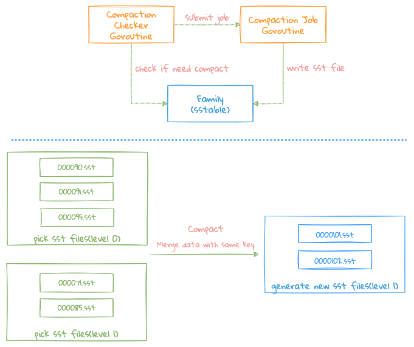

# Storage

LinDB 所有的数据都会存储在本地磁盘上，根据不同的数据类型有不同的存储结构：
- Metirc Metadata: 存储 Metric Name 及其下面的 Fields
- Tags: 存储一个 Metric 下面所有的 Tags，这部分分为 2 种数据类型
    * 正向：Series ID 对应的 Tags
    * 反向：存储 Tag Key/Value 的倒排索引，即每个 Tag Value 下面有哪些 Series ID，Series ID 使用 [RoaringBitMap](http://roaringbitmap.org) 来存储
- Data: 所有 Time Series 下 Data Point 的存储

以上所有的数据类型都存储在底层一个通用的 KV Store 里面。

## 时序特性

在讲存储之前，首先来讲一下时序的特性，如图：


时序数据特性（根据其时间特性可以分为不随时间变化和随时间变化的数据）
1. Time Series => Metric + Tags：这部分数据基本都是字符串，而且该数据占数据包的大头，但是不会随时间变化而变化，
尽量把字符串变换成数值来存储，以降低存储成本
2. Fields：这部分数据基本都是数值，并且随着时间变化而变化，但是数值类型容易做压缩

## 存储结构

### Database


- 一个数据库的数据按 Shard 分散在 Storage 集群的不同节点上
- 一个 Shard 可以有多个副本

### Shard

```
├─ db_test_1
|  ├─ index
|  |  ├─ metric_meta
|  |  ├─ metric_ids
|  |  ├─ inverted_1
|  |  ├─ forward_1
|  |  ├─ inverted_2
|  |  └─ forward_2
|  └─ shard
|     ├─ 1
|     |  └─ segment
|     |     ├─ day
|     |     |  ├─ 20190101
|     |     |  |  ├─ 01
|     |     |  |  ├─ 02
|     |     |  |  └─ 23
|     |     |  └─ 20190102
|     |     ├─ month
|     |     |  ├─ 201901
|     |     |  |  ├─ 01
|     |     |  |  ├─ 02
|     |     |  |  └─ 31
|     |     |  └─ 201902
|     |     └─ year
|     |        ├─ 2019
|     |        |  ├─ 01
|     |        |  ├─ 02
|     |        |  └─ 12
|     |        └─ 2020
|     └─ 2
└─ db_test_2
```

如上是数据在一台 Storage 节点上面的存储目录结构，以单个数据库在单节点上的数据结构为例：
- index: 存储所有的 metadata 和 index
  * metadata: 是数据库级别的，即所有的 shard 共享这些数据
  * index: 每个 Shard 都会有自己的 forward 和 inverted 数据
- shard: 一个数据库在单节点上会存在多个 shard

所有的数据根据数据库的 Interval 来计算按时间片来存储具体的数据
 1. 这样的设计主要为了方便处理 TTL，数据如果过期，直接删除相应的目录即可
 2. 每个 shard 下面会存在多个 segment，每个 segment 根据对应 interval 来存储相应时间片的数据
 3. 为什么每个 segment 下面又按 interval 存储很多个 data family？这个主要因为 LinDB 主要解决的问题是存储海量的监控数据，一般的监控数据基本是最新时间写入，基本不会写历史数据，而整个 LinDB 的数据存储类似 LSM 方式，所以为了减少数据文件之间的合并操作，导致写放大,所以最终衡量下来，再对 segment 时间片进行分片。
 
下面以 interval 为 10s 为例说明:
1. segment 按天来存储
2. 每个 segment 按小时来分 data family，每个小时一个 family，每个 family 中的文件再按列存储具体的数据

## KV Store

```
└─ kv_store_1
   ├─ CURRENT
   ├─ LOCK
   ├─ MANIFEST-000010
   ├─ OPTIONS
   ├─ family_1
   |  ├─ 000001.sst
   |  ├─ 000002.sst
   |  ├─ 000004.sst
   |  └─ 000008.sst
   ├─ family_2
   |  ├─ 000011.sst
   |  ├─ 000012.sst
   |  ├─ 000014.sst
   |  └─ 000018.sst
   └─ family_3
```

整个 KV Store 类似 LSM，但是又有别于 LSM，主要的区别如下：
- 没有 Memory Table, 因为整个系统会有一个 Memory Database 来存储当前一段时间的所有数据，包括 index 和 data, 这些数据会直接写文件到 KV Store 中
- Key 都是 uint32, 因为根据时序特性会把所有的 string 转换成 uint32，所以底层的 KV Store 直接设计成 uint32 => binary

整个目录跟 rocksdb 很像，支持 family。
- CURRENT: 记录当前有效的 MANIFEST 文件
- LOCK: 文件锁，防止多进程打开同一个 KV Store
- MANIFEST: 所有 sstable 变更的 change log，包括一些 sequence 的 change log 等
- OPTIONS: KV Store 配置信息，包括每个 family 级别的配置信息
- KV Store 下可以存储多个 family，每个 family 下面存储多个 sstable 文件

### Compaction



Compaction 主要是把 Level 0 中的文件合并到 Level 1 中，目前 LinDB 只有 2 级 Level，这个有别于 LevelDB。

Compaction 条件，符合以下任意一个条件都会触发Compact任务
- Level 0 中的文件数超过配置的文件数

合并过程目前会有 2 类
- 直接把 Level 0 的文件移到 Level 1 上，但需要满足需要 compact 的条件，pick files from level 0 的文件数为 1，pick fiels from level 1 的文件数为 0；
- 需要把多个文件合并成一个大的文件

Compact 过程
1. 选取需要 Compact 的文件，首先选取当前 level 0 的文件，再遍历每个 level 0 的文件，按 key range 从 level 1 取与其有重合的文件，这里为什么按每个 level 0 的文件，而不是按 level 0 中最终的 key range 来取 level 1 的文件。因为整个 level 0 中的文件的 keys 可能是比较散列的，这样如果取最终的 range 话可能拿到一个很大的范围。例如：

``````text
for example:
Level 0:
    file 1: 1~10
    file 2: 1000~1001
    
Level 1:
    file 3: 1~5
    file 4: 100~200
    file 5: 400~500
    
- 如果按 level 0 最终 range 的话，1~1001，这样的就会把 level 1 的文件全取出来
- 如果按每个 level 0 的 range 来取的话，那最终只需要取 file 3（1~5）这个文件就可以
``````

2. 整个 compact 过程其实是一个多路合并的过程，由于 flush 写文件的时候 key 是排好序的，所以 compact 只需要按顺序读取每个文件，并且按 key 的顺序从这些文件中遍历数据即可
  - 过程中需要把 key 相同的数据进行合并，合并的过程需要根据不同的数据类型来合并，需要实现 Merger Interface
  - 如果 key 不需要合并的操作，直接把对应的数据写到文件中，这样就可以减少不必要的序列化操作
3. compact 合并写文件成功完成，需要把 Version Edit 提交到 Version Set 中，此时 Version Edit 中包括了新写的文件和需要删除的老文件，这个过程需要锁
4. 删除一些无用的文件，如已经合并掉的文件，或者失败之后的一些中间结果文件，这里需要注意的是一定要在 Version Edit 提交到 Version Set 成功之后，作清理操作，否则会导致数据文件错乱问题

> - Version Edit: 类似 LevelDB ，会把每次写文件操作都记录一个 Version Edit ，Version Edit 记录新增文件/删除文件，这样就可以做到当系统重启或者 Crash，只要重新加载一遍 Version Edit Log 就可以提到整个有用的文件有那些。 
> - Version Set: 记录当前存储有哪些文件可用。